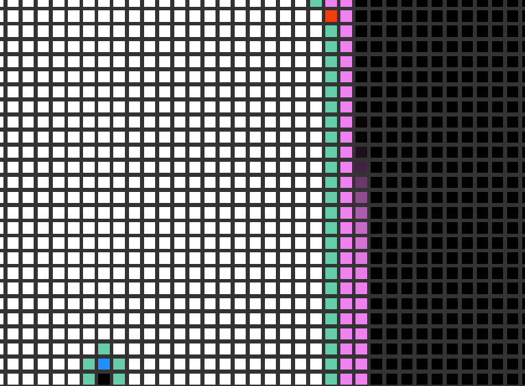

# Path-finding algorithms

BFS             |  DFS
:-------------------------:|:-------------------------:
 |  


*Pathfinding or pathing is the plotting, by a computer application, of the shortest route between two points. It is a more practical variant on solving mazes. This field of research is based heavily on Dijkstra's algorithm for finding the shortest path on a weighted graph.*

- [Path_Finding](https://en.wikipedia.org/wiki/Pathfinding)


## Usage

```
git clone https://github.com/OwenGranot/Pathfinding-Algorithms-Visualizor
cd Pathfinding-Algorithms-Visualizor
npm install
npm run dev
```

## Supported Algorithms:

- BFS
- DFS


